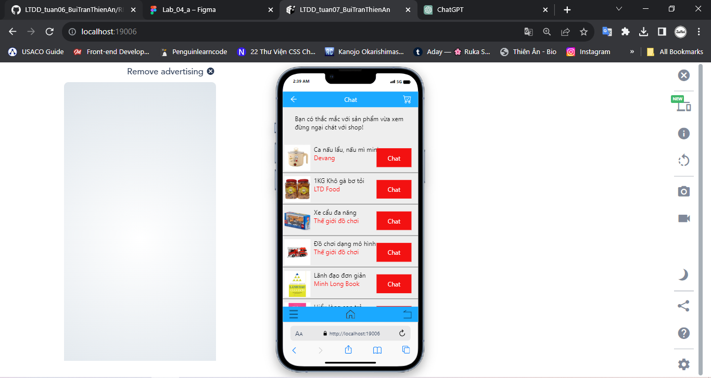
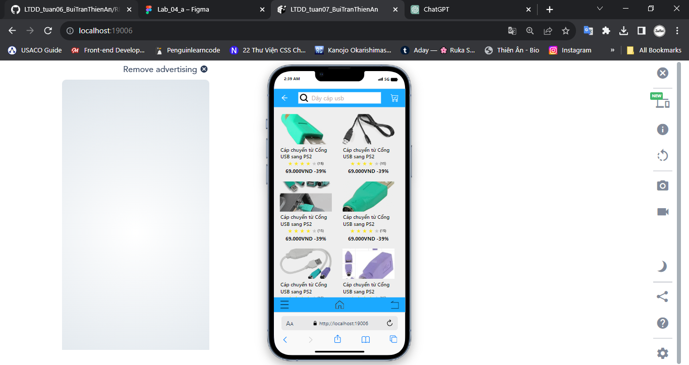

# LTDD_tuan07_BuiTranThienAn
# 1. Screen01

# 2. Screen02

# 3. Handle when clicking on item in Screen01
- Create 2 states, isHovered and indexPress
-  \`{[styles.item, isHovered && indexPress == index ? styles.itemHovered : null]}\`

